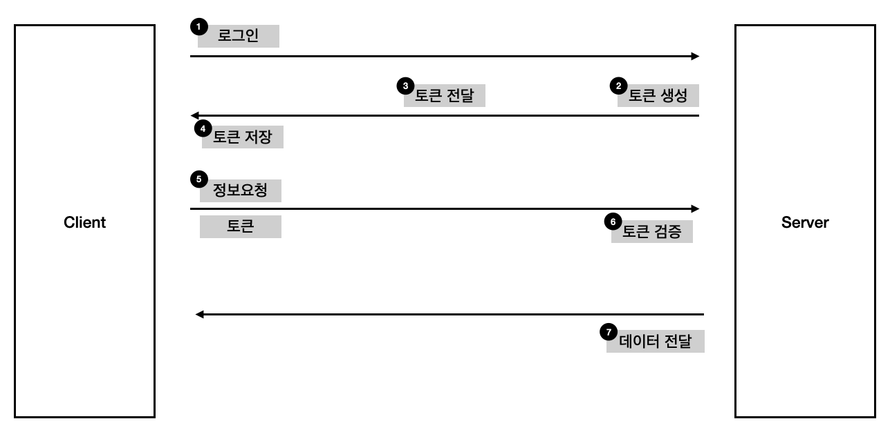

# 사용자를 인증하는 여러가지 방법들

### 인증과정이 없다면

서버와 클라이언트가 데이터를 주고받을 때 중요한 데이터가 오가는 경우가 있을 수 있습니다. 대표 적인 경우가 개인정보등을 다루는 일인데, 이때 내가 아닌 다른사람도 서버에 접근할 수 있다면 매우 위험할 수 있습니다.

이러한 문제가 발생하기때문에 고전적으로는 `ID, PW` 방식을 통해서 서버에서 데이터들을 보호해왔습니다.

사용자가 `ID, PW` 를 서버에 전달하면 서버는 그 값을 가지고 있다가 다음에 사용자가 동일한 `ID, PW` 로 접근하게되면 그에 대한 데이터를 사용자에게 제공하게됩니다. 

<p align="center">
  
</p> 

### 쿠키와 세션

HTTP 통신은 `비연결성(conectionless)` 의 특성을 지니기 때문에 한번 통신이 일어나고 난 후에는 통신이 끊어지게 됩니다. 즉 `ID, PW` 를 통해서 사용자를 인증했다고 해서 다음 요청도 그 사용자가 맞다는 보장이 없습니다.

예를 들어서 우리가 쇼핑몰에 로그인을 했을 때 로그인 했던 사용자와 옷 구매를 클릭하는 사용자가 동일하거라는 보장이 없는 것 입니다.

이를 해결하기 위해서 등장한 것이 쿠키와 세션입니다.

##### 쿠키 ( Cookie )

쿠키는 브라우저에 저장되는 데이터입니다. `4KB` 정도의 작은 공간을 차지하고 있습니다.
먼저, 클라이언트가 서버에 요청을 날리게되면 서버에서 쿠키를 생성해서 `Response` 에
`Set-Cookie` 라는 헤더로 전달하게 됩니다. 

<p align="center">
  
</p> 

쿠키를 전달받은 브라우저는 쿠키를 브라우저에 저장시켜두고 브라우저가 종료되더라도 보관하고 있습니다. 이후에 같은 요청을 날릴 때 브라우저는 `Request` 에 쿠키를 함께 넣어서 서버로 전송하게 됩니다.

예를들면, 쇼핑몰 사이트에서 장바구니 기능이나 사이트의 로그인을 유지하는 기능등이 쿠키를 활용합니다.

##### 세션 ( Session )

하지만 브라우저에 저장되는 데이터는 위변조될 위험성이 있습니다. 개인정보나 `ID, PW` 와 같은 정보를 쿠키에 저장한다면 탈취되었을 때 위험할 수 있습니다. 그래서 세션이라는 기술이 함께 쓰이게 됩니다.

클라이언트가 서버로 요청을 날리면 서버는 각각 클라이언트를 식별할 수 있는 `sessionID` 를 `Cookie` 를 통해서 클라이언트에게 전달하게 됩니다. 이 정보는 쿠키에 저장되기 때문에 브라우저를 종료해도 남아있게되고, 다음에 동일한 요청을 날릴 때 `sessionID` 를 포함해서 요청을 날리게되면 서버는 `sessionID` 를 통해서 `sessionDB` 에 값을 가져와서 사용자 정보를 확인하게 됩니다. 

<p align="center">
  
</p> 

하지만 세션은 정보를 서버쪽에서 관리하기떄문에 접속자가 많아지면 `sessionDB` 쪽에 부하가 걸리게됩니다.

### JWT (JsonWebtoken)

`jwt` 는 `json` 을 활용한 토큰 기반 인증방식입니다.
`session` 과 다르게 서버에 정보를 저장하고 있지않고 `token` 자체에 정보를 저장함으로서
서버쪽 데이터베이스의 부하를 줄일 수 있습니다.

<p align="center">
  
</p> 

JWT 는 아래와 같이 구성되어있습니다. 각각의 내용들을 `base64` 로 인코딩한 후 `.` 으로 이어붙이게 되면 실제로 사용하는 `JWT` 형태가 완성됩니다.

<p align="center">
  
</p> 

##### Header

`alg` 는 암호화 알고리즘의 종류이고 `kid` 는 서명시 사용하는 키를 식별하는 값입니다.
```json
{
    "alg" : "ES256",
    "kid": "Key ID"
}
```

##### Payload

`JWT` 에 실제 내용이 들어가는 부분입니다. 각각의 정보들을 `클레임(claim)` 이라고 하고 `Key-Velue` 형태의 데이터 입니다.

```json
{
    "iss": "jerrykang.com",
    "exp": "1485270000000",
    "https://jerrykang.com/jwt_claims/hello": true,
    "userId": "1102312",
    "username": "jerrykang"
}
```

##### Sginature

위의 값들을 합쳐서 인코딩한 후 서버에서 생성한 비밀키로 내용을 해싱합니다.

위 과정이 끝나면 토큰 생성이 완료됩니다.

### 정리

대표적인 인증과정인 쿠키, 세션, 토큰 기반 인증방식에 대해서 알아보았습니다.


