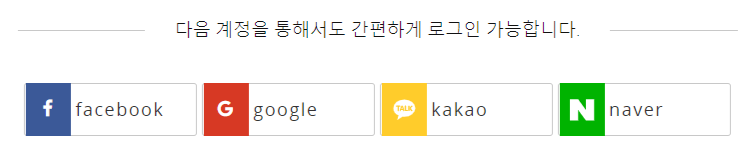

# 웹 보안을 위한 인증(Cookie, Session, JWT)

웹에서 클라이언트와 서버가 통신할 때에 가장 중요한 것이 보안이라 해도 지나치지 않다. 보안을 위해 웹에서 거치는 인증 절차와 방식을 이번 시간에 알아보도록 하겠다.

## HTTP의 약점

지난 시간에 다뤘던 HTTP의 특징을 다시 살펴보자.
**Connectless**와 **Stateless** 가 대표적인 큰 특징인데, 이러한 특징들로 인해 서버는 클라이언트의 이전 상태를 알 수 없다. 이 말은 곧, 데이터가 유지되지 않는다는 것이다.
데이터가 유지되지 않는다는 것은,
우리가 웹사이트에 로그인을 해도 페이지를 새로고침하면 로그인 상태가 유지되지 않고, 쇼핑몰 사이트에서 장바구니에 상품을 담아도 유지되지 않는다는 것이다.
이렇게 우리는 데이터가 유지되어야 하는 상황들이 몹시 많기 때문에,
**Cookie**와 **Session**을 이용한다.

---

## Cookie란

서버와 클라이언트가 통신할 때에, 서버에게 클라이언트가 누구인지를 계속해서 인증해야 하는 일이 번거롭기 때문에 Cookie라는 것이 등장했다.
Cookie는 클라이언트에 저장하는 작은 기록 정보 파일이다. Cookie는 클라이언트가 같은 웹사이트를 방문할 때마다 읽히는데, 그 안에는 이름, 값, 만료일, 경로 정보 등이 들어있다.

#### Cookie 동작 방법

클라이언트가 서버에 페이지를 요청할 때, 서버는 Cookie를 생성해 페이지와 함께 클라이언트에게 보낸다.
(서버는 Set Cookie라는 HTTP 헤더를 사용해 클라이언트에게 보내고, 클라이언트에서 key값으로 이루어진 cookie값이 생성된다.)

이 Cookie는 클라이언트의 PC에 저장되고, 같은 서버에 요청할 때마다 요청과 함께 쿠키를 보낸다.
이러한 방식으로 서버에서는 클라이언트가 이전에 인증한 사용자라는 것을 알 수 있는 것이다.

#### Cookie의 문제점

HTTP의 문제점을 쉽게 해결해 준 것처럼 보이는 Cookie에게도 문제점이 있다. 클라이언트에 있는 값이기 때문에 위변조가 가능하다는 점이다.

---

## Session

이러한 Cookie의 보안성 문제를 해결하는, 인증 값이 서버에 존재하는 Session이 나오게 되었다.
이때 Session은 Cookie와 같이 어떤 값으로 이해하는 것 보단, 상태로 이해하는 것이 더 정확하다.
**클라이언트가 서버에 접속해 있는 상태** 다시 말해서, **같은 클라이언트(브라우저)에서 보내는 요청들**을 하나의 상태로 인식하고 유지하는 것이 Session이라 말할 수 있다.

#### Session 동작 방법

서버는 각 클라이언트를 식별해 Cookie값을 줄 때, 클라이언트마다 sessionID를 부여한다. 이렇게 부여된 sessionID 마다 클라이언트들의 정보들(미니 데이터베이스)이 객체값으로 서버에 저장된다. 클라이언트는 재접속할 때마다 이 sessionID 값을 서버에 전달하며 재인증을 받지 않아도 되는 것이다.

#### Session의 문제점

웹 사이트를 사용자가 늘어나자, 서버에 저장해야하는 데이터의 양이 늘어나고, 요청에 알맞는 리스폰스를 다시 보내는데에 시간이 오래 걸리게 되었다. 서버 과부하를 해결하기 위해 다음과 같은 방식이 나오게 되었다.

---

## JWT(Json Web Token)

JWT란, JSON 데이터 구조로 표현된 토큰이다. JWT의 가장 큰 장점은 암호화된 정보를 토큰에 저장하기 때문에 클라이언트 단이나 서버 단에 저장할 필요가 없다는 것이다.

#### 토큰의 구성

토큰은 세가지 요소로 구성되어있고, 그 안에 담긴 정보들은 다음과 같다.

- Header: 요소들의 암호화 방식
- Payload: 인증에 필요한 유저 고유 ID와 같은 정보들이 name/value의 한 쌍으로 이루어짐
- Signature: 서버에 있는 비밀키로 해싱(암호화)된 값

Header과 Payload는 인코딩되어있기 때문에 누구나 디코딩할 수 있지만, Signature는 비밀키를 알지 못하면 복호화할 수 없기 때문에, 토큰의 위변조에서 안전하다.

#### 토큰의 동작 방식

클라이언트가 로그인을 하면, 서버에서 비밀키를 이용해 유효기간이 정해져 있는 토큰을 발급해서 클라이언트에게 보내준다. 클라이언트는 요청할 때마다 이 토큰을 같이 보내고, 서버는 비밀키로 토큰을 복호화해서 검증하고, 해당 클라이언트 식별이 되면 응답한다. 로그아웃을 하면 토큰은 클라이언트측에서 파기된다.

#### Cookie와 Session은 사용하나?

JWT라는 방식이 나왔다고 해서 Cookie와 Session을 이용하지 않는 것이 아니다. 이 토큰은 Cookie를 통해서 보내지기도 하기 때문이다.
다만 앞에서 다뤘던 문제점들로 인해, Cookie에는 사용자의 편리성을 위한 자동완성 유무, 팝업창과 같은 탈취되어도 큰 문제가 생기지 않는 정보들 위주로 담고, Session에는 외부에 노출되어서 안되는 몇몇 중요한 정보들을 저장한다.

---

## 소셜 로그인 방식-OAuth

기존의 우리는 스스로를 증명하기 위해 각 웹 사이트마다 ID와 PW를 두고, 기억해서 로그인했다.
사용자들이 사용하는 웹사이트의 양이 늘어남에 따라 **소셜 로그인 방식**이라는 것이 등장하게 되었다.

다음은 한국형 온라인 공개강좌(K-MOOC) 사이트 로그인 창 중 일부분이다.

  

이 사이트 뿐만 아니라 우리는 타 계정으로 쉽게 회원가입하고 로그인 할 수 있는 사이트들을 많이 써보았을 것이다. 이런 소셜 로그인 방식을 사용하면 번거로웠던 회원가입 절차를 빠르게 할 수 있고, 서버에서 접근할 권한 내용을 확인할 수 있다.

### OAuth 프로토콜

이 소셜 로그인 방식은 OAuth 웹 프로토콜을 따른다. 이 프로토콜은 하나의 서버에서 다른 서버의 DB에 접근할 수 있는 권한을 준다.

#### 작동 방식

작동방식을 이해하기 위해 용어를 정리해보자.

- Resource Owner: 유저(일반 사용자)
- Resource Server: OAuth를 관리하는 서버의 자원을 관리하는 서버
- Client: Resource Server에 자원을 요청하는 서버

다음으로, 우리가 A라는 임의의 서비스를 이용하기 위해 구글로 로그인하는 상황을 생각해보자.
**우리는 Resource Owner, A는 Client, 구글은 Resource Server가 된다.**
우리가 A 서비스를 구글로 로그인 한다 해서, 구글 서버에서 A 서버로 우리의 구글 ID와 PW를 직접적으로 제공하지 않는다. OAuth 인증을 통해서 인증이 완료되면 구글에서 제공하는 정보에 A 서버가 접근할 수 있는 것이다.
