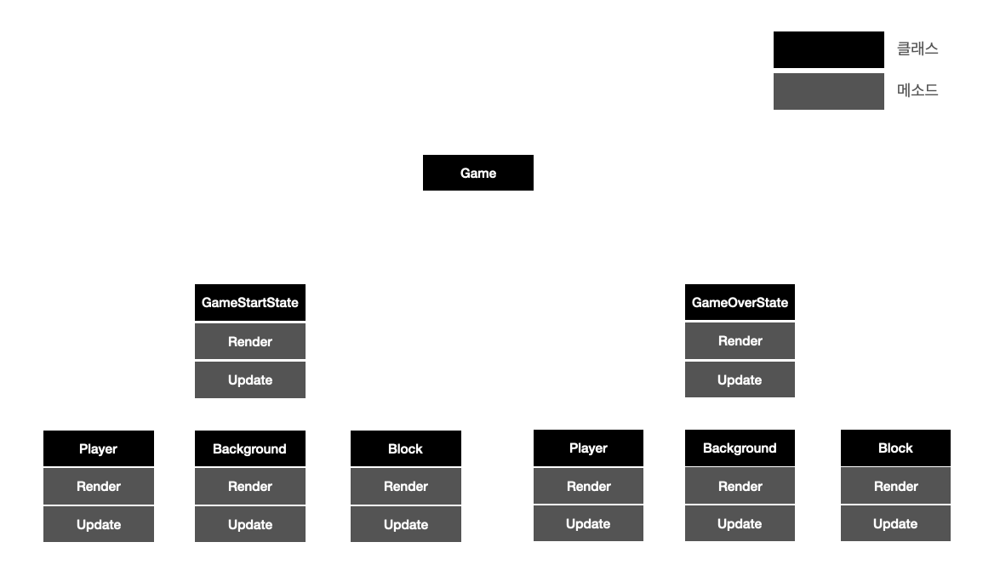

# Canvas를 활용한 객체지향 맛보기

`위 포스팅은 js class 에 대한 기본 지식을 바탕으로 진행됩니다. class 에 대해서 잘 모르시는 분들은 이전 포스팅을 참고해주세요!`
### Canvas란?

웹 환경에서 그래픽을 표현하기 위한 API로
그림판에 그림을 그리듯이 그래픽을 랜더링하는 것이 특징입니다.

### 간단한 게임 만들어보기

아래와 같이 HTML 코드를 작성하고
### 
```html
<!-- index.html -->
<html>
    <head>
        <script src='./index.js'>
    </head>
    <body>
        <canvas id="canvas"></canvas>
    </body>
</html>
```

브라우저가 로딩되면 캔버스 노드를 불러오는 코드를 작성해줍니다.
```js
/** index.js */
window.onload = () => {
    const canvas = document.getElementById('canvas');
    const ctx = canvas.getContext('2d');
}
```

캔버스에는 그래픽을 표현할 수 있는 다양한 속성들이 존재합니다.

아래와 같은 코드를 작성하게되면 (0, 0) 좌표에 가로 100, 새로 100 크기의 붉은 도형이 생성됩니다.
```js
/** index.js */
window.onload = () => {
    ...
    ctx.fillStyle = 'red';
    ctx.fillRect(0, 0, 100, 100);
    /** ctx.fillRect(x, y, width, height) */
}
```
<p align="center">
  
</p> 

먼저 키보드 의 WASD 를 입력받으면 빨간색 도형이 움직이도록 코드를 작성해 봅시다.
캔버스에서는 영역 전체가 그래픽 영역이라서, PPT 처럼 따로따로 컨트롤 할 수 없습니다.
도형을 이동시키려면 스톱모션 처럼 좌표가 이동될 때 마다 전체 그림을 다시 랜더링 해줘야합니다.

이를 구현하기 위해서 ```setInterval``` 함수를 이용하겠습니다.

```gameLoop``` 라는 함수를 생성해서 0.2초 마다 실행시키도록 하겠습니다.

```js
/** index.js */
window.onload = () => {
    ...
    setInterval(gameLoop, 20);
}

function gameLoop() {
    ctx.fillStyle = 'red';
    ctx.fillRect(0, 0, 100, 100);
}
```

붉은색 도형을 이동시켜야하기 때문에 도형의 x, y 좌표를 변수로 지정하고 
각각 WASD 가 눌릴 때 마다 좌표를 변경해주겠습니다.


키보드 입력이 감지되면 ```keyPressed``` 객체의 해당 코드값을 ```true``` 로 변경해줌으로서 
어떤 키가 눌렸는지 확인할 수 있습니다.

```js
let keyPressed;
let x = 0, y = 0;

window.addEventListener('keydown', (e) => {
    keyPressed[e.code] = true;
});
window.addEventListener('keyup', (e) => {
    keyPressed[e.code] = false;
});

window.onload = () => {
    ...
    setInterval(gameLoop, 20);
}

function gameLoop() {
    // 오른쪽 이동
    if(keyPressed['KeyD']){
        x += 10;
    }
    // 왼쪽이동
    if(keyPressed['KeyA'])){
        x -= 10;
    }
    // 위로 이동
    if(keyPressed['KeyW']){
        y -= 10;
    }
    if(keyPressed['KeyS']){
        y += 10;
    }

    ctx.fillStyle = 'red';
    ctx.fillRect(x, y, 100, 100);
}
```

간단한 게임 요소를 넣어서 이동하는 게임을 작성해봤습니다.

현재는 간단한 게임이라 코드가 짧지만 만약 여러가지 요소를 넣게되면서 규모가 커지면 코드의 길이도 길어질 수 밖에 없습니다.

위와같이 코드를 작성하게되면 여러가지 문제점들이 발생하게됩니다. 

- 가독성이 떨어진다.

- 파일 분리가 불가능하다.

- 함수나 변수이름등의 이름이 겹칠 수 있다.

- 전역변수가 많아진다.

이러한 문제점을 해결하기 위해 JS 의 ```class``` 문법을 활용하여 게임을 다시 만들어보겠습니다.

### Class 의 활용

##### GameState 관리

게임을 개발하다 보면 여러가지 생태가 필요합니다.

```GameOver```, ```GameStart```,  ```StageClear``` 등 다양한 상태를 가지며 각 상태마다 다른 화면을 표시해줘야합니다.

이를 관리하기 위해서 각 게임의 상태를 ```class``` 로 작성해줍니다.

각각 `init()`, `render()`, `update()` 메소드를 가집니다.

- `init()` 는 처음 실행되었을 때 혹은 `class`에 있는 정보를 초기화해야할 때 사용합니다.
- `render()` 는 실제 화면에 그려지는 영역을 작성하고 반복실행됩니다.
- `update()` 는 멤버 변수들의 변화를 체크하고 값을 실시간으로 변화시키는 일을 담당합니다.

```js
class GameStartState{
    constructor(){

    }
    init(){
        
    }
    render(){
        const canvas = document.getElementById("canvas");
        const ctx = canvas.getContext("2d");
        
        ctx.fillStyle = 'white';
        ctx.font = '40px Arial';
        ctx.fillText('시작!', 100, 100);
    }
    update(){
        
    }
}
```

State를 분리하게 되면 게임은 보통 아래와 같은 구조도를 가지게됩니다.


<p align="center">
  
</p> 

이러한 상태를 관리하기 위해 `StateManager` 라는 클래스를 작성해봅시다.

`GameStateManager` 는 생성될 때 `gameState` 멤버변수를 `GameStartState` 로 초기화시켜줍니다.

이후 `GameStateManager` 는 `render` 와 `update` 를 반복적으로 진행하게됩니다.

게임의 상태가 변경되면 `onChangeGameState` 를 통해서 변경할 수 있습니다.

이렇게 작성하게 되면 게임의 상태를 변경해야할 때 상태를 관리하는 클래스를 직접수정 할 필요없이

`gameStateManager.onChangeGameState(new GameState());` 로 바로 상태 변경이 가능합니다.

```js
class GameStateManager{
    constructor(){
        this.gameState = new GameStartState();
    }
    
    onChangeGameState(gameState){
        this.gameState = gameState;
        this.gameState.init();
    }

    render(){
        this.gameState.render();
    }

    update(){
        this.gameState.update();
    }
}

const gameStateManager = new GameStateManager();
```

처음에 작성했던 ```gameLoop``` 부분을 다시 작성해줍니다.

위에서 사용했던 ```setInterval``` 을 사용하지않고 자바스크립트 내장 함수인 ```requestAnimationFrame``` 을 사용합니다. 

위에서 설명했던 내용대로 각각 최상단에 있는 `Render`와 `Update` 는 `GameStateManager` 의 `update` 와 `render` 메서드를 실행하므로 상태가 변경되더라도 최상단 코드를 수정하는 일이 없어집니다.
```js

let canvasHeight;
let canvasWidth;

window.addEventListener("load", onGameInit, false);

function onGameInit(){
    const canvas = document.getElementById("canvas");
    const ctx = canvas.getContext("2d");
    canvas.setAttribute('width', window.innerWidth);
    canvas.setAttribute('height', window.innerHeight);
    canvasWidth = window.innerWidth;
    canvasHeight = window.innerHeight;

   gameLoop();
}

function Update(){
    gameStateManager.update();
}
function Render(){
    var canvas = document.getElementById("canvas");
    var ctx  = canvas.getContext("2d");

    ctx.fillStyle = "#fff";
    ctx.fillRect(0, 0, canvasWidth, canvasHeight);
    gameStateManager.render();
}

function gameLoop(){
    Update();
    Render();
    window.requestAnimationFrame(gameLoop);
}
```

##### InputSystem 만들기

키보드 입력도 분리 가능하다.

`isKeyDown` 메소드를 통해서 어떠한 키가 활성상태인지 알아볼 수 있다.

```js
window.addEventListener('keydown', (e) => {
    inputSystem.isKeyPressed[e.code] = true;
});
window.addEventListener('keyup', (e) => {
    inputSystem.isKeyPressed[e.code] = false;
});

class InputSystem{
    constructor() {
        this.isKeyPressed = [];
    }

    isKeyDown(keyCode){
        if( this.isKeyPressed[keyCode] === true ){
          return true;
        }
        else{
            return false;
        }
    }
}

const inputSystem = new InputSystem();
```

##### Player 만들기

우리는 상태를 정의했으므로 그 상태가 랜더링할 요소들을 정의해줘야한다.

생성자를 통해 `Player`의 초기 좌표를 설정해줬으며 각각 키값이 눌릴 때 마다 x, y 좌표를 변경해주고
`render` 메소드를 통해서 해당 좌표에 플레이어를 표시해줍니다.

```js
class Player{
    constructor(x, y){
        this.x = x;
        this.y = y;
    }
    init(){

    }
    render(){
        const canvas = document.getElementById("canvas");
        const ctx = canvas.getContext("2d");
        ctx.fillStyle = 'red';
        ctx.fillRect(this.x, this.y, 100, 100);
    }
    update(){
        if(inputSystem.isKeyDown('KeyD')){
            this.moveRight();
        }
        if(inputSystem.isKeyDown('KeyA')){
            this.moveLeft();
        }
        if(inputSystem.isKeyDown('KeyW')){
            this.moveUp();
        }
        if(inputSystem.isKeyDown('KeyS')){
            this.moveDown();
        }
    }
    moveLeft(){
        this.x -= 10;
    }
    moveRight(){
        this.x += 10;
    }
    moveUp(){
        this.y -= 10;
    }
    moveDown(){
        this.y += 10;
    }
}
```

##### GamePlayState 만들기

표시할 객체를 만들었으니 이를 랜더링해줄 상태를 정의해야합니다.

```js
class GamePlayState{
    constructor(){
        this.player = new Player(0, 0);
    }
    init(){
        this.player.init();
    }
    render(){
        this.player.render();
    }
    update(){
        this.player.update();
    }
}
```

이런식으로 작성하게되면 표시할 오브젝트들이 많아지더라도 
클래스가 정의가 되어있다면 깔끔하게 표현할 수 있습니다.

```js
class GamePlayState{
    constructor(){
        this.player = new Player(0, 0);
        this.otherPlayer = new OtherPlayer(0, 0);
        this.background = new Background();
    }
    init(){
        this.player.init();
        this.otherPlayer.init();
        this.background.init();
    }
    render(){
        this.player.render();
        this.otherPlayer.render();
        this.background.render();
    }
    update(){
        this.player.update();
        this.otherPlayer.update();
        this.background.update();
    }
}
```

### 정리

Canvas 를 활용해서 움직이는 로직을 만들고 `class` 문법을 활용하여 이를 구조화 하였습니다.

### 참고자료

[만들면서 배우는 HTML 게임 프로그래밍](https://m.hanbit.co.kr/store/books/book_view.html?p_code=B6799435208)


