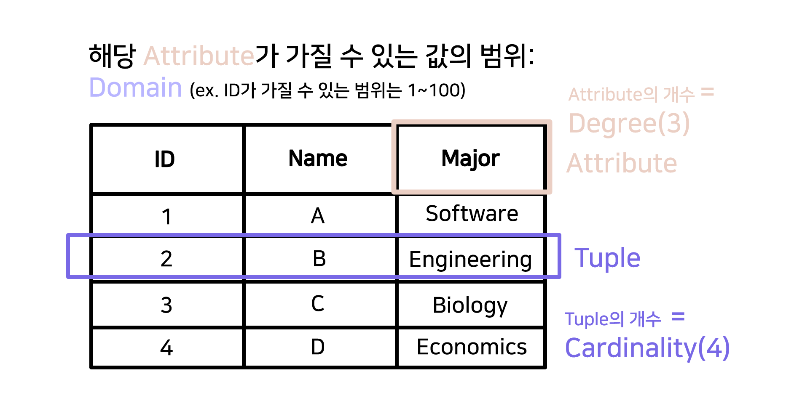

# 관계형 데이터베이스와 서버(with JS)

## 관계형 데이터베이스란?

- 관계형 데이터베이스란 key와 value의 간단한 관계를 테이블 형식으로 나타낸 데이터베이스이다. 하나의 데이터베이스 안에는 여러 개의 테이블이 존재한다. 이때의 데이터와 데이터, 혹은 테이블 간의 관계를 표현해주는 것이 관계형 데이터베이스의 특징이다.

### 관계형 데이터베이스의 구조

  

- tuple(혹은 record라고도 함): 테이블의 행, 데이터 한 건
- cardinality: tuple의 개수
- attribute: 속성
- degree: attribute의 개수
- domain: 해당 attribute가 가질 수 있는 값의 범위

### Schema(스키마)

데이터베이스의 구조와 제약조건에 관해 전반적인 명세를 기술한 것이다. 간단하게 말하면 **데이터베이스 설계도** 라고 할 수 있다. 이 스키마를 실체화 시킨 것을 인스턴스(instance)라고 한다.
스키마는 외부스키마와 내부스키마로 나누어지는데,

### DBMS(Database Management System)

DBMS란 데이터베이스 관리 시스템으로, 여러 사용자들이 데이터베이스 내의 데이터를 접근할 수 있게 해주는 소프트웨어 시스템이다.
이 시스템 사용하지 않고 파일 형식으로 데이터들을 관리한다면, 다수의 사람이 데이터에 접근하기 어렵고, 데이터를 추가하거나 수정할 때 오류가 발생하기 쉽다. 뿐만 아니라 보안성을 강화하기 위한 이유로 DBMS를 쓰기도 한다.

### SQL

SQL은 DBMS에 저장되어있는 데이터와 통신하기 위해 필요한 프로그래밍 언어이다. SQL 명령어는 다음과 같이 나뉜다.

- DDL(Data Definition Language): 데이터 정의(스키마 정의)
- DML(Data Manipulation Language): 데이터 조작(검색, 삽입, 삭제, 업데이트)
- DCL(Data Control Language): 데이터 문제점 해결(보안, 복구 등등)
- TCL(Transaction Control Language): 트랜잭션을 다룸(커밋, 롤백 등등)

## 데이터베이스와 서버 간의 통신(JS 중심)

이번 포스팅을 시작할 때 데이터베이스의 개념을 먼저 다루었다.
여태까지 네트워크 포스팅을 진행하며 클라이언트와 서버간의 통신을 간단히 이야기 했었는데, 대부분의 서비스들은 단일 서버를 이용하지 않는다.  
보통 서버를 구축할 때에 확장성과 보안성을 생각해 웹서버와 데이터베이스 서버를 분리하는데, 이 때에 웹페이지 파일과 웹 서버, 데이터베이스 서버가 어떻게 연결되어 동작하는지 다뤄보고자 한다.
(이번 포스팅은 JS 웹을 중심으로 진행된다)

### Node.js : 런타임 환경

### Express

### 미들웨어

- ORM (Object Relational Mapping)

### 템플릿 엔진

### 빌드란

- 정적파일 동적파일ss
