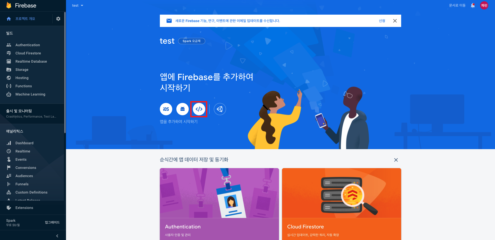
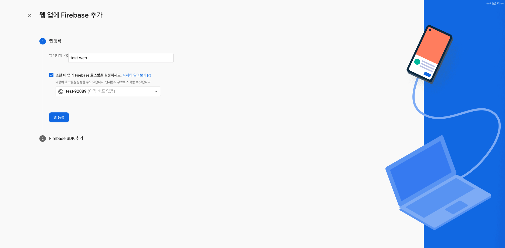

# 웹사이트 배포하기

웹사이트를 제작하고 배포하는 과정을 CS 개념에 기반하여 알아보는 글입니다.

### 나만 아는 웹사이트?

사이트를 아무리 멋지게 만들고 화려한 기능을 추가한다고 해도 사용해줄 유저들이 없다면 의미가 없습니다.

우리가 만든 웹사이트를 다른 사람들도 이용할 수 있게하기 위해서는 반드시 배포라는 과정을 거쳐야합니다.

<p align="center">
  
</p> 

### 웹서버가 필요합니다

자신의 컴퓨터를 웹서버로 사용하여 사이트를 배포할수도 있습니다. 하지만 컴퓨터의 전원이 꺼지면 사이트도 자동으로 내려가게되므로 사람들이 많이 이용하는 사이트라면 컴퓨터의 전원을 24시간 켜둬야하는 부담이 있을 수 있습니다.


이러한 일들을 대신 해주는 업체들이 바로 웹 호스팅 업체입니다.
인터넷에 연결된 컴퓨터 하나를 호스트라고 부르는데, 이 컴퓨터 하나에 공간을 쪼개서 호스팅을 요청한 고객들의 웹사이트를 웹서버를 통해서 인터넷에 올려줍니다. 

간편하다는 장점이 있지만 호스팅 업체가 제공해주는 서비스가 제한적이면
그만큼 복잡한 웹서비스를 올리는데 제약이 생길 수 있습니다.

<p align="center">
  
</p> 

### 파이어베이스를 통한 웹 호스팅

파이어베이스를 이용하면 우리의 사이트를 쉽고 빠르게 배포할 수 있습니다.

간단하게 만든 React 사이트를 파이어베이스를 통해서 직접 배포해보겠습니다.

먼저 `create-react-app test` 을 통해서 새로운 React 프로젝트를 생성해줍니다.

> create-react-app 설치되어있지 않다면 npm install -g create-react-app 을 통해서 설치해주세요!

[파이어베이스 콘솔](https://console.firebase.google.com/?hl=ko&pli=1)에 접속해서 구글로 로그인 후 프로젝트 추가를 눌러줍니다.

저는 이름을 test 라고 하겠습니다.

<p align="center">
  
</p> 

다음으로 Goolge 애널리틱스 설정화면이 나오는데, 간단한 호스팅을 위한것이니 사용안함으로 체크하고 진행하겠습니다.

<p align="center">
  
</p> 

프로잭트 생성이 완료되면 아래와 같은 화면이 나오게됩니다.

웹을 배포할 것이기 때문에 시작하기에서 웹을 선택합니다 

<p align="center">
  
</p> 

추가할 웹사이트의 이름을 설정해주고 Firebase 호스팅 설정을 체크해줍니다.
<p align="center">
  
</p> 

해당 스크립트를 React 프로젝트의 `public/index.html` 에 넣어줍니다.
```html
<!DOCTYPE html>
<html lang="en">
  <head>
    <meta charset="utf-8" />
    <link rel="icon" href="%PUBLIC_URL%/favicon.ico" />
    <meta name="viewport" content="width=device-width, initial-scale=1" />
    <meta name="theme-color" content="#000000" />
    <meta
      name="description"
      content="Web site created using create-react-app"
    />
    <link rel="apple-touch-icon" href="%PUBLIC_URL%/logo192.png" />
    <link rel="manifest" href="%PUBLIC_URL%/manifest.json" />
    <title>React App</title>
  </head>
  <body>
    <noscript>You need to enable JavaScript to run this app.</noscript>
    <div id="root"></div>
  </body>
  <script src="/__/firebase/8.2.9/firebase-app.js"></script>
  <script src="/__/firebase/init.js"></script>
</html>
```

이후에 Firebase CLI 를 설치합니다.

```shell
$ npm install -g firebase-tools
```

설치가 완료되면 프로젝트를 만들었던 구글 계정으로 로그인을 진행합니다.

```shell
$ firebase login
```

로그인이 완료되면 기본설정을 시작해줍니다.

```
$ irebase init
```
우리는 호스팅서비스를 이용할 것이기 때문에 호스팅을 체크를 해줍니다.

```

     ######## #### ########  ######## ########     ###     ######  ########
     ##        ##  ##     ## ##       ##     ##  ##   ##  ##       ##
     ######    ##  ########  ######   ########  #########  ######  ######
     ##        ##  ##    ##  ##       ##     ## ##     ##       ## ##
     ##       #### ##     ## ######## ########  ##     ##  ######  ########

You're about to initialize a Firebase project in this directory:

  /Users/gang-eunsol/Desktop/test

? Which Firebase CLI features do you want to set up for this folder? Press Space
 to select features, then Enter to confirm your choices. (Press <space> to selec
t, <a> to toggle all, <i> to invert selection)
 ◯ Database: Deploy Firebase Realtime Database Rules
❯◯ Firestore: Deploy rules and create indexes for Firestore
 ◯ Functions: Configure and deploy Cloud Functions
 ◯ Hosting: Configure and deploy Firebase Hosting sites
 ◯ Storage: Deploy Cloud Storage security rules
 ◯ Emulators: Set up local emulators for Firebase features
```

우리는 이미 프로젝트를 만들었기 때문에 `Use an existing project ` 를 선택해줍니다.
```
=== Project Setup

First, let's associate this project directory with a Firebase project.
You can create multiple project aliases by running firebase use --add, 
but for now we'll just set up a default project.

? Please select an option: (Use arrow keys)
❯ Use an existing project 
  Create a new project 
  Add Firebase to an existing Google Cloud Platform project 
  Don't set up a default project 
```

배포할 파일이 있는 폴더를 지정해줍니다. 기본값은 `public` 이지만 `npm build` 를 하게되면 `build` 폴더로 나오기 때문에 `build` 로 지정해줍니다.
```
=== Hosting Setup

Your public directory is the folder (relative to your project directory) that
will contain Hosting assets to be uploaded with firebase deploy. If you
have a build process for your assets, use your build's output directory.

? What do you want to use as your public directory? (public) 

```

이미 `index.html` 이 있기때문에 `N` 라고 해줍니다.
```
? Configure as a single-page app (rewrite all urls to /index.html)? (y/N) 
```

이 부분도 이미 파일이 존재하기때문에 `N` 라고 해줍니다.
```
File build/index.html already exists. Overwrite? (y/N) 
```

설정이 완료되면 아래 명령어를 통해서 React 프로젝트를 빌드해줍니다.
빌드가 완료되면 `build/` 하위에 파일들이 생성됩니다. 

```shell
# yarn build
$ npm run-script build 
```

그리고 아래 명령어를 통해서 배포를 시작하게됩니다.

```shell
$ firebase deploy
```

배포가 완료되면 호스팅된 URL 이 나오게되고 해당 URL 로 접속시 우리가 만든 React 프로젝트를 확인할 수 있다.
```
=== Deploying to 'test-92089'...

i  deploying hosting
i  hosting[test-92089]: beginning deploy...
i  hosting[test-92089]: found 20 files in build
✔  hosting[test-92089]: file upload complete
i  hosting[test-92089]: finalizing version...
✔  hosting[test-92089]: version finalized
i  hosting[test-92089]: releasing new version...
✔  hosting[test-92089]: release complete

✔  Deploy complete!

Project Console: https://console.firebase.google.com/project/test-92089/overview
Hosting URL: https://test-92089.firebaseapp.com
```

### 정리

웹 호스팅에 대한 개념을 알고 파이어베이스 웹 호스팅 기능을 통해 정적사이트를 배포해보았습니다.