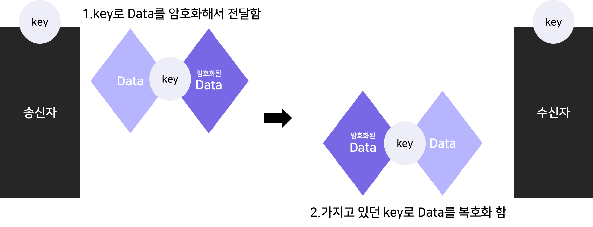

# HTTPS와 암호화

저번 시간에 우리는 HTTP에 대해서 살펴보았다.
그런데, 우리가 자주 쓰는 웹사이트들의 URL들을 살펴보면 궁금증이 생길 것이다.

  

다음은 네이버 메인 URL인데, 자세히 보면 'http'가 아니라 'https'라고 되어있다. 이번 시간에는 https에 대해 알아보고, 그것에 따른 암호화 
과정에 대해 살펴보겠다.

## HTTPS란?

HTTPS의 정의는 다음과 같다.
**HyperText Trnsfer Protocol over Secure Socket Layer,
HTTP over TLS, HTTP over SSL, HTTP Secure**
간단히 말하자면 HTTPS는 HTTP의 보안이 강화된 버전이라는 것이다.
HTTP는 일반 텍스트 프로토콜로 설계 되었고, 전송되는 정보들이 암호화되지 않기 때문에 도청을 비롯한 중간 공격에 취약하다.
이러한 문제를 해결하기 위해 HTTPS 프로토콜은 SSL(보안 소켓 계층)을 사용한다. 이 SSL 인증서는 정보를 암호화하는 역할을 하는데, 이를 좀 더 이해할 수 있도록 암호화에 대한 내용을 먼저 다루도록 하겠다.

## 대칭 키 암호화 비대칭 키 암호화

인터넷이 발달하면서 많은 데이터들이 클라이언트와 서버 사이에 오가게 되었고, 이에 데이터 보안도 같이 발전하게 되었다. 초기에는 대칭 키 암호화 방식을 쓰다가, 그 불편함과 문제점이 발견되면서 SSL에서 사용하는 것과 같은 비대칭 키 암호화 방식을 사용하게 되었다.

### 대칭 키 암호화

대칭키 를 사용한다는 것은 암호화/복호화(암호화 된 것을 해독) 할 때 사용하는 키가 같다는 것이다. 즉, 송신자와 수신자가 동일한 키를 가지고 있어야 한다는 의미이다.
그렇기에 송신자는 암호화된 데이터를 보내기 전에 수신자가 그것을 열어볼 수 있도록 암호화 할 때 썼던 키와 동일한 키를 전달해야했고, 이 점 자체가 보안상에 문제가 될 수 밖에 없었다. 철저하게 비공개로 키를 주고 받는 것이 보안의 최선이었던 것이다.

  

  

### 비대칭 키 암호화

대칭 키 암호화의 문제점으로 인해 나오게 된 것이, 비대칭 키를 이용한 공개키 암호화이다. 암호화하는 키와 복호화 하는 키를 다르게 두어(비대칭적), 하나의 키가 공개되어도 보안이 깨지지 않는 방법을 고안한 것이다.
대칭 키 암호화 방법을 쓰면, 사전에 키를 수신자에게 전달했어야 했다.
하지만, 이 비대칭 키 암호화를 쓰면 공개 채널 상에서 통신할 때 전달하고자 하는 데이터와 함께 키를 전달할 수 있는 것이다.
어떻게 이런 방법이 가능하게 된 것일까?
비대칭 키 암호화에는 **public key**와 **private key**가 존재한다.
public key는 공개하는 키, private key는 자신만이 아는 키이다.
그리고 이 두 키는 일대일 관계이다.(하나의 public key에는 하나의 private key만 존재한다)
이때, public key로 암호화한 것은 private key로 복호화할 수 있고, private key로 암호화한 것은 public key로 복호화할 수 있다.
이 암호화 알고리즘은 어디에 중점을 두느냐에 따라 그 사용분야가 달라진다.

첫번째는, **데이터 보안**이다.
A가 암호화한 데이터를 B에게 전달하는 상황을 생각해보자.

1. B가 public key와 private key를 생성한 다음, public key를 공개한다.
2. A는 이 public key로 데이터를 암호화 해서 B에게 보낸다.
3. B는 private key로 데이터를 해독한다.

  

두번째는, **데이터 발행자 증명 및 위조 방지**이다.
A가 발행한 데이터를 B에게 보낼 때, A는 그 데이터를 자신이 발행했음을 증명하고 싶고, 위조를 막고 싶은 상황을 생각해보자.

1. A가 public key와 private key를 생성한다.
2. A는 데이터를 private key로 암호화한다.
3. A는 그 데이터를 public key와 함께 인터넷에 공개한다.
4. B는 그 데이터를 public key로 해독할 수 있다
   = A의 private key로 암호화 된 데이터라는 것을 신뢰할 수 있다.

이 방법은 **전자 서명**이라고도 불리는데, 우리가 흔히 사용하는 공인인증체계가 이 방법으로 이루어져 있다.

  

## SSL 인증

암호화에 대해서 이해했으니, 다시 HTTPS 이야기로 돌아와 보자.
우리는 HTTPS가 HTTP의 보안이 강화된 버전이고, 이때 SSL/TLS는 비대칭 키 암호화 방식을 사용한다는 것을 이해했다.

  

그렇다면 우리가 보는 웹사이트의 보안을 어떻게 신뢰할 수 있는지를 앞의 내용으로 설명할 수 있다.
앞의 비대칭 키 암호화에서 다룬 두번째 **데이터 발행자 증명 및 위조 방지** 사용분야를 생각해보자.

HTTPS로 공개 웹사이트를 보호한다는 것을 신뢰할 수 있도록 서명 인증 기관(CA)에서 보증하는 **SSL 디지털 인증서**라는 전자화된 문서를 제공한다. 이 문서는 private key로 암호화되어 있다.
우리가 접속하고 싶은 웹페이지의 URL을 입력하면, 해당 웹페이지의 서버가 그 요청을 읽고, 우리의 웹 브라우저에게 private key로 암호화된, 즉 인증받은 웹페이지를 리스폰스로 날려준다. 우리가 사용하는 웹 브라우저는 공개된 public key를 가지고 있기에 인증에 성공하고, 안전하게 웹 페이지를 볼 수 있게 되는 것이다.

우리는 이러한 인증방식을 통해서 우리(클라이언트)와 웹 서버 사이에서 주고받는 데이터가 양방향으로 암호화되고 있고, 그 자체를 신뢰할 수 있는 것이다.

  

우리가 자주 사용하는 네이버 사이트에 접속해보았다.
크롬 브라우저에서는 URL 검색창 부분에 자물쇠로 HTTPS가 사용되고 있음을 표시해주고 있다. 이 자물쇠 아이콘을 클릭하면 보고 있는 웹사이트를 어떤 CA의 인증서가 보증하고 있는지도 알 수 있다.

---

## RSA 암호화

마지막으로 가장 많이 사용되는 비대칭 키 암호화 알고리즘 중 **RSA 암호화**에 대해서 간단하게 설명하고자 한다.
(HTTPS와 SSL 인증서까지 설명의 흐름을 지키고자 이 내용을 포스팅의 끝에 배치했다)

public key와 private key가 한 쌍을 이루는데,
public key로 암호화한 것은 private key로 복호화할 수 있고, private key로 암호화한 것은 public key로 복호화할 수 있다.
정말 큰 수는 소인수분해하기 힘들다는 것을 이용해 고안했고, 이 체제를 개발한 사람의 성을 따서 RSA 암호화라고 그 이름이 지어졌다.

`페르마의 소정리`가 중심 알고리즘 역할을 하는데, 생각나는 소수들을 놓고 생각해 보면 컴퓨터로 대입 몇백번을 해보면 보안이 풀릴 것처럼 간단해 보인다.
그렇기에, 실제로는 엄청나게 큰 수를 사용한다.
RSA-896, RSA-1024 와 같은 버전을 지나 현재 사용하고 있는 RSA-2048에서 사용하고 있는 수는 617자리 수이다.

`25195908475657893494027183240048398571429282126204032027777137836043662020707595556264018525880784406918290641249515082189298559149176184502808489120072844992687392807287776735971418347270261896375014971824691165077613379859095700097330459748808428401797429100642458691817195118746121515172654632282216869987549182422433637259085141865462043576798423387184774447920739934236584823824281198163815010674810451660377306056201619676256133844143603833904414952634432190114657544454178424020924616515723350778707749817125772467962926386356373289912154831438167899885040445364023527381951378636564391212010397122822120720357`

이 정도의 수는 컴퓨터로 푸는데 시간과 자원이 많이 필요하고, 이 키를 풀기 전에 시간마다 키들이 바뀌기에 보안성이 보장된다고 할 수 있다.
하지만, 2009년도에 RSQ 768bit가 풀렸던 것처럼 언제까지 이 RSA-2048이 절대적으로 안전하다고 말할 수는 없다. 실제로 양자 컴퓨터가 등장하게 된다면, 더 짧은 시간에 이 암호를 해독할 수 있게 될 것이다.
(그때에는 더 획기적인 암호화 알고리즘이 나올 것을 기대한다)
