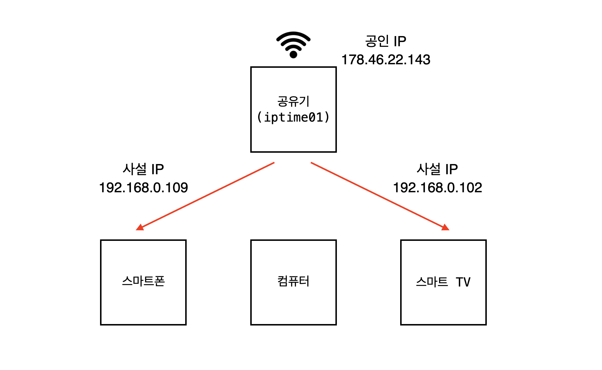

# 인터넷 대한 이해 (1)

우리는 평소 검색해야하는 일이 있을 때 구글이나 네이버에 접속해서 검색창에 단어를 입력하여 검색합니다. 우리가 이러한 행동을 할 때 내부적으로는 어떤 일이 일어나는지 전반적으로 알아보려고 합니다.

### OS

우리가 컴퓨터의 프로그램들을 이용하기위해서는 반드시 `OS(Operating System)`가 필요합니다.

<p align="center">
  
</p> 

`OS`는 컴퓨터의 자원을 효율적으로 관리하고 응용프로그램이 동작할 수 있는 환경을 만들어줍니다.

평소에 쓰는 크롬 브라우저도 OS 위에서 동작하는 응용프로그램중 하나입니다.

### 클라이언트와 서버

웹 페이지에 접속하려면 웹 브라우저가 필요합니다. 
네이버의 메인페이지의 정보는 우리의 컴퓨터안에 저장되어있지 않습니다. 네이버의 웹사이트 정보는 네이버의 웹 서버에 저장되어있기 때문에 우리가 브라우저에게 네이버의 주소를 입력하면 
브라우저는 네이버의 웹서버에게 네이버의 페이지를 요청하게됩니다.

<p align="center">
  
</p> 

브라우저는 웹 서버로 페이지를 요청하게되고 웹 서버는 요청에 알맞는 페이지를 반환하는 역할을 합니다. 이때 요청하는 이 브라우저를 클라이언트라고 하고 페이지를 제공하는 웹서버를 서버라고 합니다.

<p align="center">
  
</p> 

만약 필자가 옷가게를 운영한다고 하고 독자분이 옷을 사러오면 필자는 주인이 되고 독자는 손님이 됩니다. 그런데, 필자도 옷이 필요해서 백화점을 가게되면 백화점 입장에서는 백화점이 주인이 되고 필자가 손님이 됩니다. 여기서 정보따위를 제공하는 주인이 서버이고 옷을 구매하러온 즉 정보를 요청하러온 쪽을 클라이언트라고 합니다.


### IP 주소 

정보를 주고받기위해서 요청한 쪽과 요청을 받는 쪽이 명확해야합니다. 만약에 명확한 정보가 없다면 엉뚱한 곳으로 요청이 가게되고 통신에 혼선이 생기게됩니다. 그래서 인터넷에서는 IP 주소라는 식별자를 가지고 통신 기기들을 식별하게 됩니다.

##### IP 주소란?

`IP (Internet Protocol)` 는 IPv4 체계를 기준으로 12개의 숫자로 이루어져있습니다.
`0.0.0.0` 부터 `255.255.255.255` 까지 나타낼 수 있습니다.

IP 주소는 우리가 맘대로 부여하는 것이 아니라 `ICANN` 이라는 기관이 국가별로 사용할 수 있는 IP의 대역을 관리합니다.

우리나라에서는 `한국인터넷진흥원(KISA)` 이 우리나라 내부에서 사용할 수 있는 IP 주소를 관리합니다. `KISA` 는 국내에 할당된 IP 주소를 KT와 SKT 같은 우리나라의 `인터넷 서비스 공급자 (ISP)` 에게 재할당 합니다.

IP 를 할당 받은 `ISP` 들은 각각 기관의 서버와 가정집으로 IP 를 할당하게 됩니다.

<p align="center">
  
</p> 

위에서 설명한 IPv4 체계는 42억개의 주소를 표현할 수 있습니다.

하지만 현대사회에서 통신 기기들이 기하급수적으로 늘어나게되면서 42억개의 IP는 턱없이 부족한 현상이 발생하였습니다. 실제로 2011년에 IP는 이미 고갈되었습니다.

모두가 IP를 할당받을 수 없게돠자 이후에 여러가지 해결방법들이 등장하게 됩니다. 대표적인 해결책이 `공인IP (Public IP)` 와` 사설 IP (Private IP)` 입니다.

아래 그림처럼 ISP 에서 각 가정집에 공인IP 를 할당하게 되면 해당 공유기에 연결된 기기들에게 사설IP를 부여합니다. 사설IP 는 각 공유기에서 부여하는 것이기때문에 다른 공유기가 부여한 사설IP 와 겹치는 것이 가능합니다.

<p align="center">
  
</p> 

가정집에 있는 공유기의 뒷편을 보면 대부분 아래 그림과 같이 생겼습니다. `WAN (Wide Area Network)` 단자는 위에서 이야기 했던 `ISP` 가 제공하는 공인 IP 와 연결하는 곳을 위미합니다.

`LAN (Local Area Network)` 단자에 각 기기들을 연결하면 사설 IP 를 부여받게 됩니다. 또한 공유기에 와이파이에 얀결해도 마찬가지로 사설 IP가 연결된 기기에 부여됩니다.

이를 통해서 IP 부족 현상을 해결할 수 있었으며 공인 IP 하나를 가지고 여러개의 기기에게 인터넷 서비스를 제공할 수 있게되었습니다.

<p align="center">
  
</p> 

### 포트포워딩

**NAT (Network Address Translation)**

그럼 공유기는 어떻게 사설IP 와 공인IP 연결시켜주는 걸까요? 이는 공유기에 내장되어있는 `NAT` 는 사설IP 로 연결된 통신 기기들을 하나로 묶어서 하나의 공인IP 로 통신할 수 있도록 도와줍니다.


##### 포트

각 기기에는 통신이 필요한 서로 다른 프로그램들이 동작합니다. 스마트폰에도 카카오톡, 크롬 브라우저등 인터넷을 필요로하는 프로그램들이 굉장히 많습니다. 이 프로그램들을 네트워크 공간에 정박시켜주는 역할을 하는 것이 포트입니다.

IP 뒤에 `:8080` 과 같은 형태로 붙으며 `0`번 포트부터 `65535` 포트 까지 사용할 수 있습니다. 
이중에 `0` 번 포트부터 `1024` 포트까지는 Well-known 포트라고 불리며 미리 정해진 프로그램들이 돌아갑니다. 대표적으로 `ssh` 는 `22` 번 포트이고 `http` 는 `80` 번 포트입니다.

##### 포트포워딩

만약에 우리가 지금 사용하고 있는 컴퓨터를 서버로 이용하려면 어떻게 해야할까요? 

`crate-react-app` 을 통해서 `react` 앱을 만들고 우리가  컴퓨터에 `npm start` 통해서 웹페이지를 띄우게 되면 

아래와 같은 화면을 볼 수 있습니다. 여기서 `192.168.1.161` 는
현재 공유기로 부터 부여받은 사설 IP 주소를 의미합니다.
```shell
Compiled successfully!

You can now view test2 in the browser.

  Local:            http://localhost:3000
  On Your Network:  http://192.168.1.161:3000

Note that the development build is not optimized.
To create a production build, use yarn build.

```
해당 웹페이지는 같은 와이파이에 접속한 사람들이라면 `192.168.1.161:3000` 으로 접속하여 같은 페이지를 볼 수 있습니다. 

하지만 다른 네트워크를 사용하고있는 사람들은 해당 주소로 접속하더라도 우리가 띄운 웹 페이지를 볼 수 없습니다.

현재 사용하고 있는 공인IP가 `178.46.22.143` 라고 가정하고
우리가 띄운 `192.168.1.161:3000` 와 공인IP의 `178.46.22.143:8080` 을 연결한다면 외부네트워크에 연결되어있는 사용자도 `178.46.22.143:8080` 를 통해서 우리가 띄운 웹 페이지를 볼 수 있게됩니다. 이처럼 `IP:PORT` 와 `IP:PORT` 를 연결하는 과정을 **포트포워딩** 이라고 합니다
 <p align="center">
  
</p> 

### 정리

우리는 특정한 프로그램이 OS 위에서 돌아가고 다른 프로그램과 인터넷을 통해서 통신하기 위해서는 IP, PORT 등 여러가지 기술이 필요하다는 것을 알게되었습니다. 다음 포스팅에서는 인터넷에 접속되는 과정과 HTTP, HTTPS 에 대해서 포스팅해보겠습니다.


