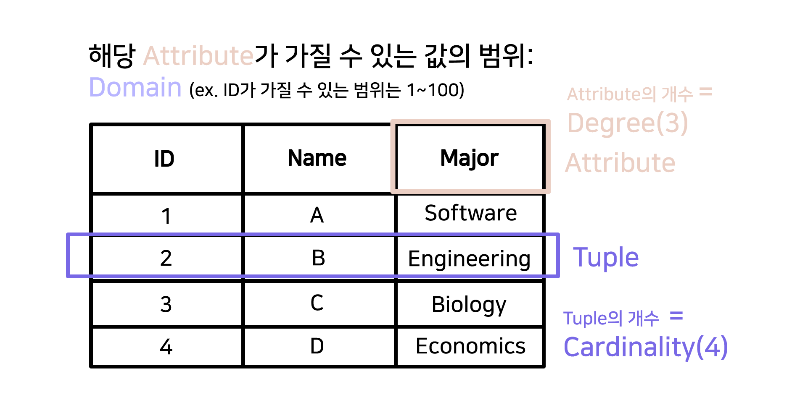
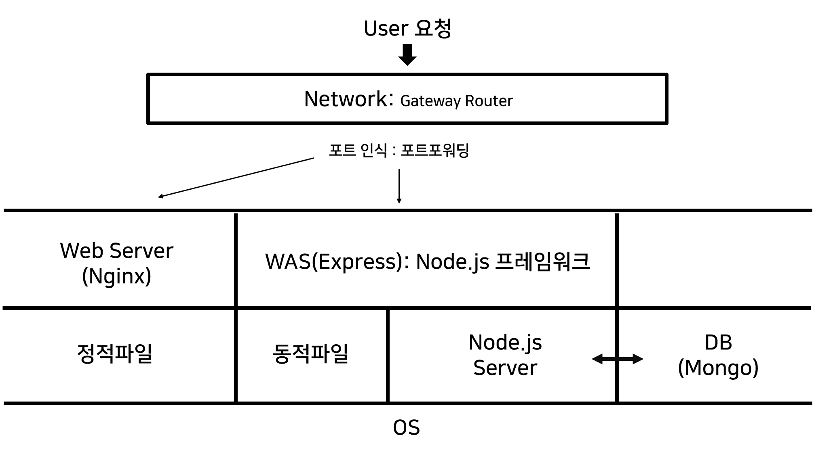

# 관계형 데이터베이스와 서버(with JS)

## 관계형 데이터베이스란?

- 관계형 데이터베이스란 key와 value의 간단한 관계를 테이블 형식으로 나타낸 데이터베이스이다. 하나의 데이터베이스 안에는 여러 개의 테이블이 존재한다. 이때의 데이터와 데이터, 혹은 테이블 간의 관계를 표현해주는 것이 관계형 데이터베이스의 특징이다.

### 관계형 데이터베이스의 구조

  

- tuple(혹은 record라고도 함): 테이블의 행, 데이터 한 건
- cardinality: tuple의 개수
- attribute: 속성
- degree: attribute의 개수
- domain: 해당 attribute가 가질 수 있는 값의 집합

### Schema(스키마)

데이터베이스의 구조와 제약조건에 관해 전반적인 명세를 기술한 것이다. 간단하게 말하면 **데이터베이스 설계도** 라고 할 수 있다. 이 스키마를 실체화 시킨 것을 인스턴스(instance)라고 한다.
스키마는 외부스키마와 내부스키마로 나누어지는데,
외부스키마는 '데이터를 어떤 구조로 나타내어 유저에게 보여줄 것인지'와 같은 내용을 담고,
내부스키마는 '데이터를 물리적으로 저장하는 구조'에 관한 내용을 담는다.

### DBMS(Database Management System)

DBMS란 데이터베이스 관리 시스템으로, 여러 사용자들이 데이터베이스 내의 데이터를 접근할 수 있게 해주는 소프트웨어 시스템이다.
이 시스템 사용하지 않고 파일 형식으로 데이터들을 관리한다면, 다수의 사람이 데이터에 접근하기 어렵고, 데이터를 추가하거나 수정할 때 오류가 발생하기 쉽다. 뿐만 아니라 보안성을 강화하기 위한 이유로 DBMS를 쓰기도 한다.

### SQL

SQL은 DBMS에 저장되어있는 데이터와 통신하기 위해 필요한 프로그래밍 언어이다. SQL 명령어는 다음과 같이 나뉜다.

- DDL(Data Definition Language): 데이터 정의(스키마 정의)
- DML(Data Manipulation Language): 데이터 조작(검색, 삽입, 삭제, 업데이트)
- DCL(Data Control Language): 데이터 문제점 해결(보안, 복구 등등)
- TCL(Transaction Control Language): 트랜잭션을 다룸(커밋, 롤백 등등)

---

## 데이터베이스와 서버 간의 통신(JS 중심)

이번 포스팅을 시작할 때 데이터베이스의 개념을 먼저 다루었다.
여태까지 네트워크 포스팅을 진행하며 클라이언트와 서버간의 통신을 간단히 이야기 했었는데, 대부분의 서비스들은 단일 서버를 이용하지 않는다.  
보통 서버를 구축할 때에 확장성과 보안성을 생각해 웹서버와 데이터베이스 서버를 분리하는데, 이 때에 웹페이지 파일과 웹 서버, 데이터베이스 서버가 어떻게 연결되어 동작하는지 다뤄보고자 한다.
(이번 포스팅은 JS 중심으로 진행된다)

  

이 구조도를 이해하는 것이 이번 포스팅의 목표이다.

### Node.js : 런타임 환경

Node.js는 Chrome V8 엔진으로 빌드된 JS 런타임이다.
런타임은 프로그래밍 언어가 구동되는 환경으로, Node.js가 없었던 때에는 JS가 브라우저에서만 구동되었다.
이번 포스팅에서는 이 런타임에 대해서 깊이 알아보는 것이 아니라, Node.js가 **WAS(Web Application Server)** 로 구동된다는 것에 초점을 맞추도록 하겠다.

### Web Server vs WAS(Web Application Server)

우리는 빌드한 파일을 웹 브라우저에 띄우기 위해 거쳐야 하는 작업이 있다. 이때 파일을 **정적파일**과 **동적파일**로 분류할 수 있다.

- 정적파일 : 바뀌지 않는 항상 동일한, 정적인 파일 (html, css, vanila js)
- 동적파일 : 웹 서버에 있는 데이터들을 가공처리하고, 클라이언트의 요청을 해석해 그에 맞는 데이터를 반환함. 실시간으로 바뀌는 데이터로 인해 달라지는 페이지를 보게 됨

#### Web Server

- 웹 브라우저에게서 HTTP요청을 받아 정적인 파일을 제공하는 컴퓨터 프로그램
- 주요 기능 1 :정적인 컨텐츠 제공(WAS를 거치지 않고 바로 자원 제공)
- 주요 기능 2 : 동적인 컨텐츠 제공을 위한 요청 전달

클라이언트 요청→ Web Server ( 클라요청을 전달)→ WAS→Web Server(응답을 전달)→ 클라이언트

ex) Apache, Nginx

#### WAS(Web Application Server)

- 사용자의 다양한 요청을 처리해야 하는 동적인 컨텐츠를 제공
- Web Server와 DBMS 사이에서 동작하는 **미들웨어**
- 물리적으로 분리되어 있어 보안성을 유지할 수 있음

ex) Apache Tomcat, Express(JS 프레임워크)

### 미들웨어란?

WAS가 미들웨어라고 소개하고 있다.
미들웨어는 원래 시스템 소프트웨어와 응용 소프트웨어 사이 또는 두 가지 다른 종류의 응용 프로그램 사이에서 조정 및 중개 역할을 하는 프로그램을 의미하지만,
웹에서의 미들웨어를 이야기할때는,
웹 브라우저와 DBMS 사이에서 데이터를 주고받을 수 있도록 중간에서 매개 역할을 하는 소프트웨어이다.

Node.js에서 이 미들웨어 역할을 잘 수행할 수 있도록 도와주는 것이 **Express** 프레임워크이다.

#### ORM (Object Relational Mapping)

Node.js에서는 ORM 툴을 제공한다.
ORM은 <객체-관계 매핑>이란 뜻으로, 객체와 관계형 데이터베이스의 데이터를 자동으로 연결 해주는 것을 말한다.
개발자가 SQL문을 직접적으로 다루지 않아도, 객체를 통해 간접적으로 데이터를 다룰 수 있도록 도와주는 것이다.
ORM을 통해서 객체 간의 관계를 바탕으로 SQL을 자동으로 생성해 불일치를 해결하는 등 개발의 생산성이 향상된다는 장점이 있지만,
미세한 수정이나 디버깅, 복잡한 쿼리문의 대응이 어렵다는 단점이 있다.
