# AWS EC2 사용하기

AWS EC2란, Amazon Web Services에서 제공하는 Elastic Compute Cloud 서비스를 뜻한다.
이 서비스를 쉽게 설명해보자면, 아마존에서 (가상에 존재하는) 컴퓨터를 임대해 주는 것이다. 그래서 이것에 내가 원하는 OS를 선택할 수 있고, 필요한 프로그램들을 설치할 수 있다. EC2를 이용하면 간단하게 필요한 용량을 확장하거나 축소할 수도 있고, 여러개의 서버 인스턴스들을 동시에 다룰수 있게 된다. 간단한 웹 배포는 무료로 가능하고, 비교적 저렴하게 서비스를 이용할 수 있다는 것이 그 장점이다.

# EC2를 이용해 서버에 웹 올리기

## 1. 인스턴스 생성

여기서의 인스턴스는 앞서 말했던 컴퓨터를 뜻한다.
먼저, 위치하는 도시를 설정한 다음, 솔루션 구축에서 'EC2를 사용하여'를 클릭한다.

  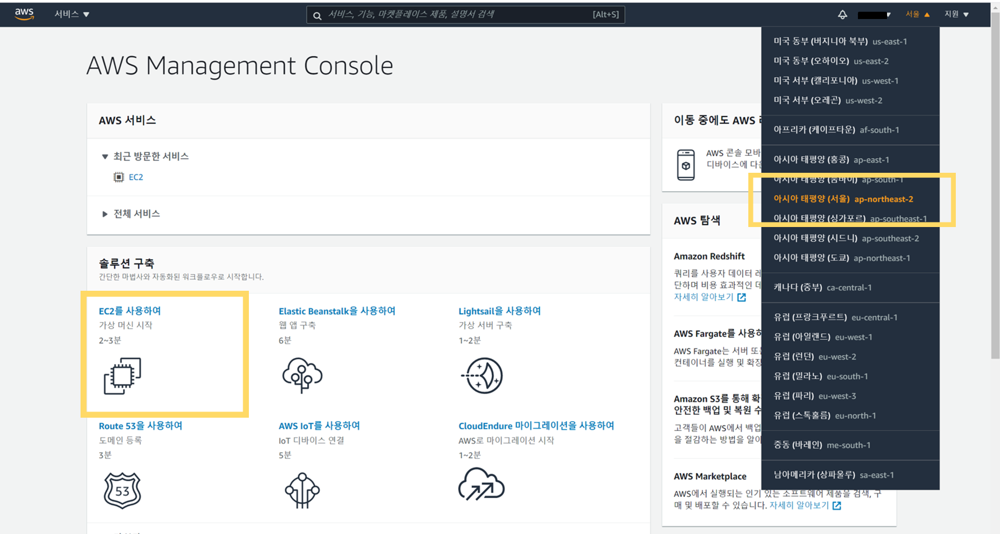

 
'인스턴스 시작'을 클릭한다.

  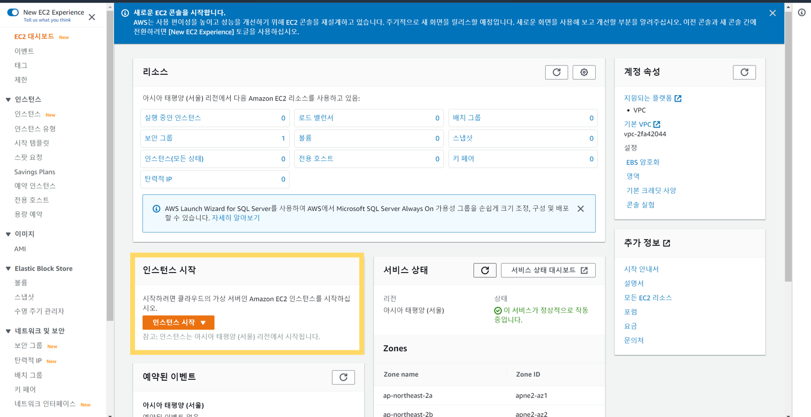

 
1단계로 Amazon Machine Image(AMI)를 선택한다.
취향에 따라 원하는 운영체제를 선택한다. 여기서 나는 Ubuntu Server을 선택했다.

  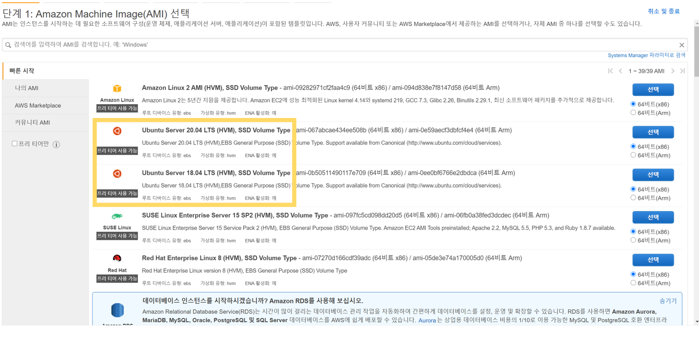

 
다음, 2단계로 인스턴스 유형을 선택한다.
메모리와 네트워크 성능을 고르는 구간인데,
무료로 진행하기 위해 프리 티어 사용 가능이라고 표시되어 있는 것을 선택했다.
이 부분에서 '다음: 인스턴스 세부 정보 구성'을 클릭하면 인스턴스 구성, 스토리지와 태그 추가, 보안 그룹과 관련된 세부 사항들을 적용할 수 있다.
이 단계는 나중에도 추가할 수 있기 때문에 빠른 생성을 원하면 바로 '검토 및 시작'을 눌러 진행하도록 한다.

  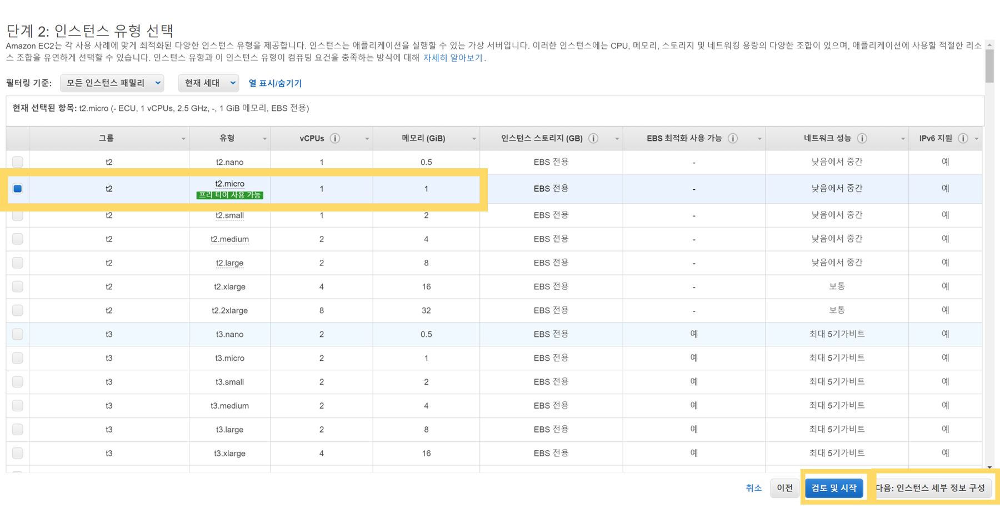

 

  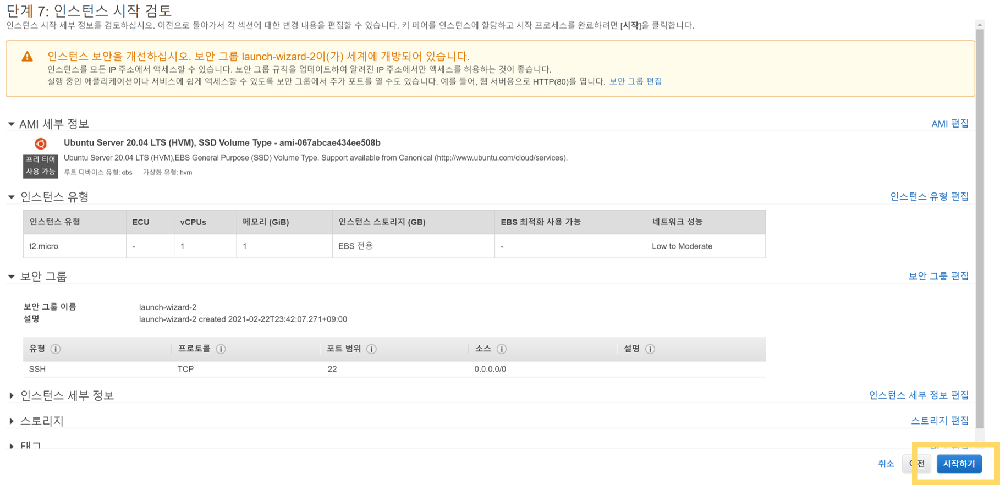

시작하기 버튼을 눌렀다면, 다음과 같은 '기존 키 페어 선택 또는 새 키 페어 생성' 모달창이 생성된다.

처음 키를 만드는 것이라면 '새 키 페어 생성' 기존의 키가 있다면 '기존 키 페어 선택'을 선택한다.키 페어 이름을 정하고 .pem 파일을 다운로드 받는다. 이 때의 이 파일은 인스턴스에 접속할 때 비밀번호의 역할을 한다. 이 키는 한번만 발급되기 때문에 잘 보관해두어야 하고, 유출되지 않도록 관리해야 한다.

  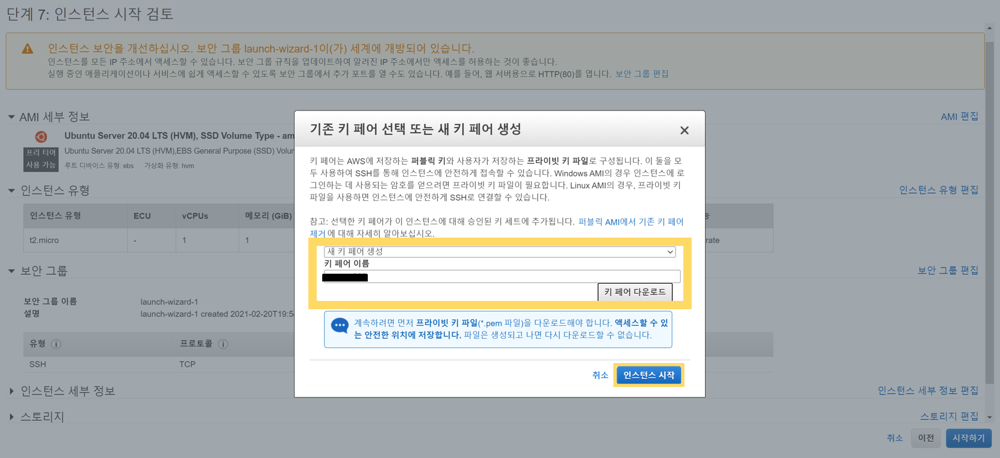

인스턴스 생성이 완료되었다!

  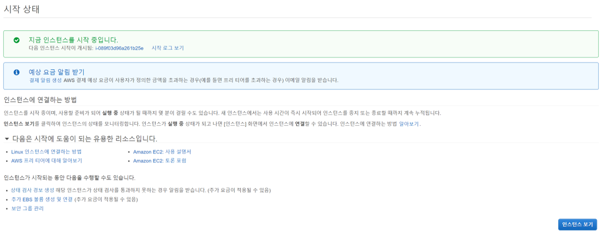

## 2. 보안그룹의 인바운드 / 아웃바운드 규칙 정하기

인스턴스 생성이 완료된 후 EC2 서비스의 사이드 바에서 [네트워크 및 보안] -> [보안 그룹]에 들어가면 보안 그룹을 생성할 수 있다.

  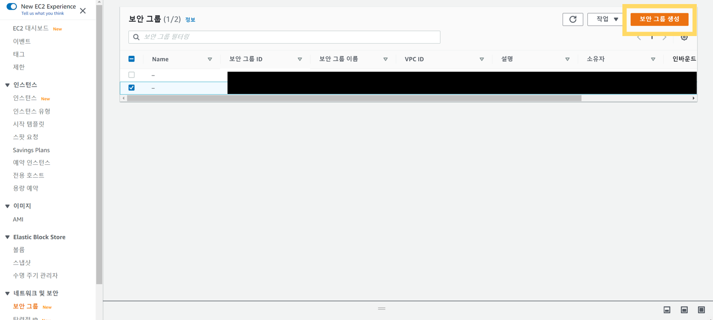

생성 버튼을 누르면, 보안 그룹 이름, 인바운드 및 아웃바운드 규칙을 설정할 수 있다. 간단하게, 인바운드는 외부에서 서버 내부로 진입할 때, 아웃바운드는 서버에서 외부로 나갈 때라고 이해한다. 이 규칙들을 정해주어 접속할 수 있는 포트범위와 대상들을 지정한다.

  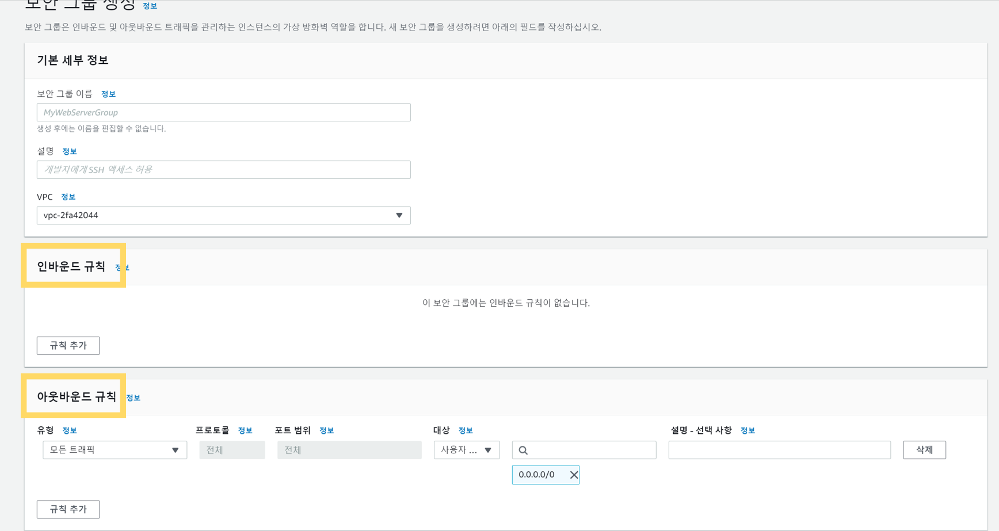

다음은 실제로 배포한 페이지의 아웃바운드 규칙들이다. 각 유형, 프로토콜,포트범위, 대상을 지정한다.

-이때 대상을 0.0.0.0/0 과 ::/0으로 두면 대상이 전세계 사용자들로 설정이 된다.

  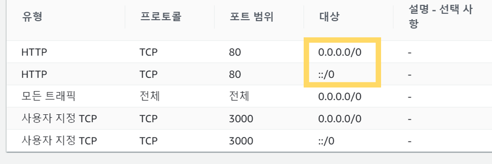

## 3. Powershell에서 원격접속으로 서버 열기

앞 단계들이 완료되었다면, powershell에서 만들어둔 pem파일을 가지고 ubuntu서버로 접속해보겠다.
powershell에서 pem파일, 운영체제 이름, 퍼블릭 IP주소를 다음과 같이 적어준다.
`ssh -i "XXX.pem" ubuntu@X.X.XXX.XXX`
서버 접속 성공! Welcome to Ubuntu!

  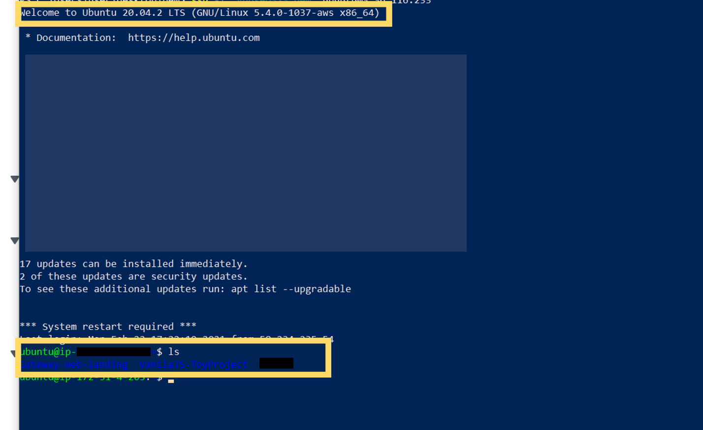

git clone으로 배포하고 싶은 웹 프로젝트를 서버에 올린다. 리눅스 명령어로 서버에 올려져 있는 파일들을 확인한 후 배포할 웹을 선택한다.
저 파일 중 react로 만든 Gateway-web-landing을 올리겠다. Ubuntu에 Node.js를 설치한 후, 간단하게 해당 파일에서 yarn start를 하면 react 파일이 실행되는 것을 확인할 수 있다

(Vanila Js와 같은 정적 파일을 배포하는 법은 추후에 다루도록 하겠다.)

파일이 실행되었다면, IP주소에서 지정해둔 포트로 접속해보자! (나는 PORT 3000으로 지정해두었다.)

  

실행시키고 싶었던 웹이 서버에 올라간 것을 확인했다!

# 남은 과제

이렇게 간략하게 AWS EC2를 통해 웹을 배포하는 방법을 정리해보았다. 그러나 남은 과제들이 있다.

- powershell을 끄면 서버도 함께 꺼진다. 이 문제점을 해결하는 방법이 필요하다.
- 정적 파일을 web server 프로그램을 이용해 배포하는 법을 알아보자.
- 숫자로 이루어진 IP주소는 매번 기억하기 어렵다. 도메인을 구매하고 적용하는 방법을 알아보자.

다음 포스팅에서 이러한 내용들을 다뤄보도록 하겠다.
